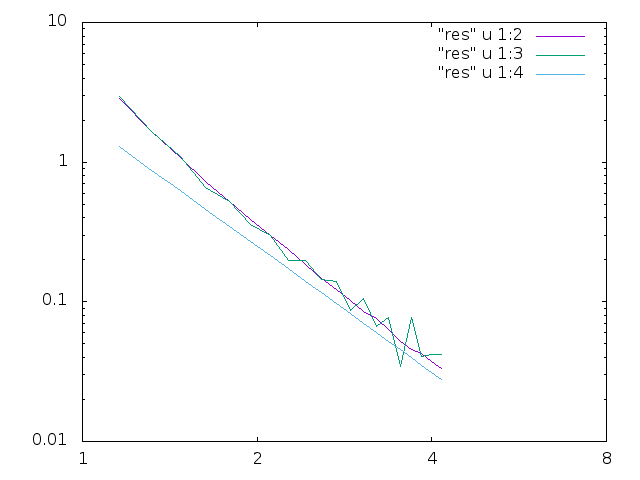

# Final Part 2
## Collaborators: Basant Kandel & Christine Caron

The main code in the final part of this project was created to measure the electrostatic potential energy
of two cubes that are separated by a unit distance. In order to measure this potential I needed to compute a six dimensional integral for each
of the three coordinates. The integration was performed by a vegas integration method, and another created code using the monte-carlo 
integration method. All of these integration methods are show in the below figure.

The vegas integration method led a time of about 280 secs, and the monte carlo integration method timed around 16 secs. However, 
the accuracy failed to compare to the vegas integration method. The monte carlo method converged at 1/sqrt(N) which meant that it was 
imperative to increase the number of calculations to a factor 10^2 in order to acheive a similar accuracy to the vegas integration method.
